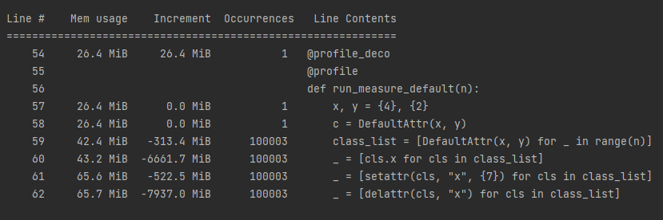
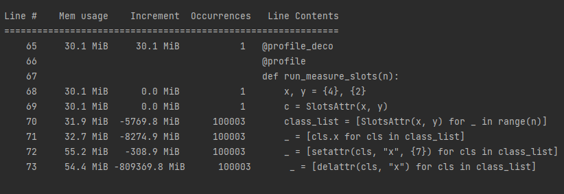
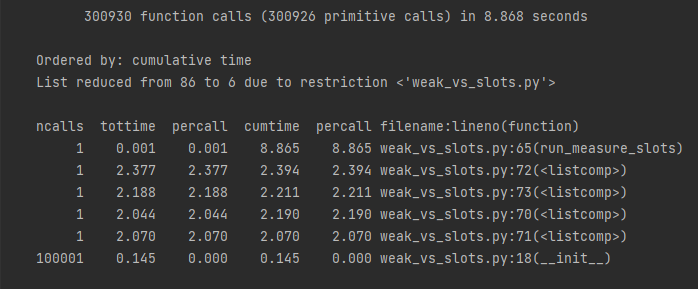

## 1. Профилирование класса с обычными атрибутами

Отметим
- суммарное время на инициализацию: 4.337 c,
- суммарное время доступа: 0.428 c,
- суммарное время изменения: 6.503 c,
- суммарное время удаления: 2.145 c,
- выделенная память на 10^5 объектов: 15.8 MiB

## 2. Профилирование класса со слотами

Отметим
- суммарное время на инициализацию: 1.071 c,
- суммарное время доступа: 0.449 c,
- суммарное время изменения: 7.903 c,
- суммарное время удаления: 1.909 c,
- выделенная память на 10^5 объектов: 2.2 MiB

## 3. Профилирование класса с атрибутами weakref

Отметим
- суммарное время на инициализацию: 6.942 c,
- суммарное время доступа: 9.803 c,
- суммарное время изменения: 0.453 c,
- суммарное время удаления: 7.056 c,
- выделенная память на 10^5 объектов: 11.6 MiB

